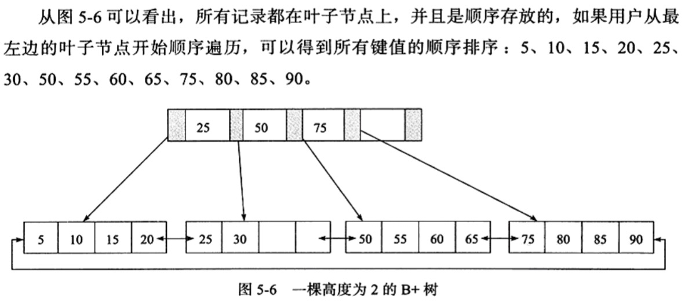
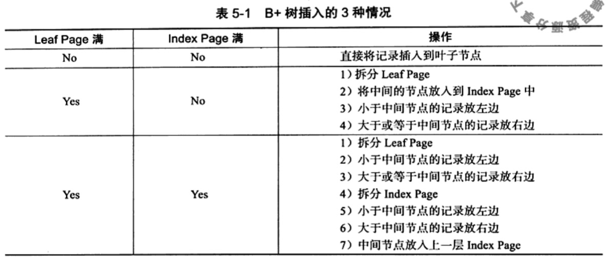
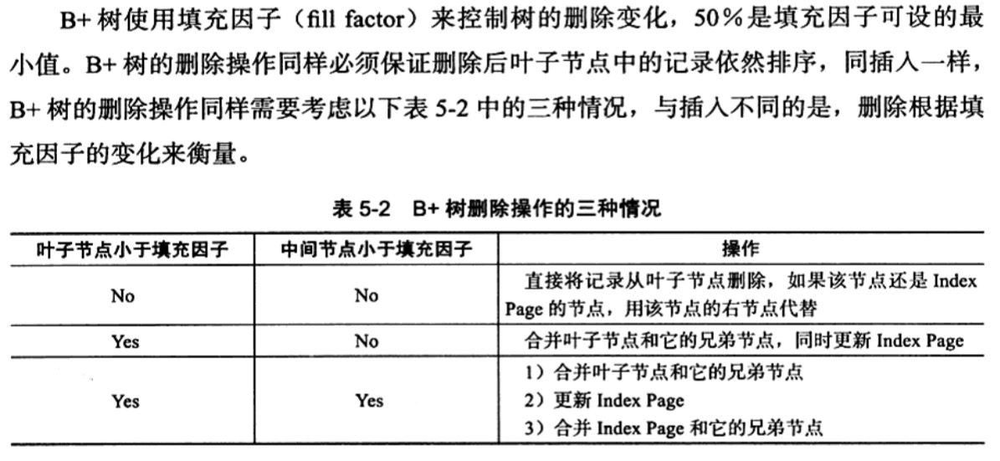

InnoDB 存储引擎支持以下常见几种索引：

1. B+ 树索引（构造类似于二叉树，k/v键值快速查找，B(balance)是从平衡二叉树演化而来，但B+树不是二叉树。B+树索引并不能找到一个给定键值的具体行。B+树索引能找到的只是被查找数据行所在的页。然后数据库通过把页读入到内存，再在内存中进行查找，最后得到要找的数据）
2. 全文索引
3. 哈希索引（自适应，不能认为干预是否在一张表中生成哈希索引）

## B+ 树索引

#### B+树是通过二叉查找树，再由平衡二叉树，B树演化而来。

1. 二叉查找树中，左子树的键值总是小于跟的键值，右子树的键值总是大于跟的键值。因此可以通过中序遍历得到键值的排序输出。
2. 平衡二叉树（AVL）：首先符合二叉查找树的定义，其次必须满足任何节点的两个子树的高度最大差为1。
3. B+树是为磁盘或其他直接存取辅助设备设计的一种平衡查找树。在B+树中，所有记录节点都是按键值的大小顺序存放在同一层的叶子节点上，由各叶子节点指针进行连接。

    先来看一个B+树，高度为2， 每页可存放4条记录，扇出（fan out）为5。

    
    <!-- {:width="50%"} -->

    B+树插入一条数据

    

    B+树删除一条数据

    

#### B+树索引的本质就是B+树在数据库中的实现。（可以分为 聚集索引和辅助索引）

- 聚集索引（clustered index）按照每张表的主键构造的一颗B+树，同时叶子节点存放的即为整张表的行记录数据，也将聚集索引的叶子结点称为数据页。
- 辅助索引（Secondary index）叶子节点不包含行记录的全部数据。

