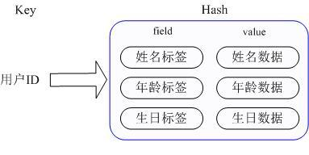
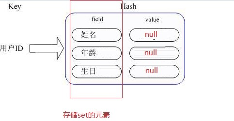

## 一. 几种常用数据结构
1. String

```
key-value键值对
# 对不存在的键进行设置
redis 127.0.0.1:6379> SET key "value" OK 
redis 127.0.0.1:6379> GET key -> "value"

# 使用 EX 选项
redis 127.0.0.1:6379> SET key-with-expire-time "hello" EX 1000 -> OK 
redis 127.0.0.1:6379> GET key-with-expire-time "hello" 
redis 127.0.0.1:6379> TTL key-with-expire-time (integer) 9996

# 数值累加
redis> SET page_view 20 -> OK 
redis> INCR page_view (integer) 21 
redis> GET page_view # 数字值在 Redis 中以字符串的形式保存 "21"

# 批量操作（能用上的场景强烈建议使用，效率远大于多次单个操作）
redis> MSET date "2012.3.30" time "11:00 a.m." weather "sunny" -> OK 
redis> MGET date time weather 1) "2012.3.30" 2) "11:00 a.m." 3) "sunny"

# 常用场景
1）验证码5分钟有效期 redis.set("13800000801", "123456", "EX", 300);
2) 页面浏览次数统计 redis.incr("page_view");
3）存储对象 redis.set("id_xxx", JSON.stringify(object), "EX", 3600*24*30);
省的清理（+过期时间 必设）
```

2. HASH哈希


比如我们要存储一个用户信息对象数据，包含以下信息：
用户ID，用户姓名，年龄，生日等信息，如果用普通的key/value结构来存储，将用户ID作为查找key,把其他信息封装成一个对象以序列化的方式存储，这种方式的缺点是，增加了序列化/反序列化的开销，并且在需要修改其中一项信息时，需要把整个对象取回，并且修改操作需要对并发进行保护，引入CAS等复杂问题。
那么Redis提供的Hash很好的解决了这个问题，Redis的Hash实际是内部存储的Value为一个HashMap，并提供了直接存取这个Map成员的接口，如下图：



也就是说，Key仍然是用户ID, value是一个Map，这个Map的key是成员的属性名，value是属性值，这样对数据的修改和存取都可以直接通过其内部Map的Key(Redis里称内部Map的key为field), 也就是通过 key(用户ID) + field(属性标签) 就可以操作对应属性数据了，既不需要重复存储数据，也不会带来序列化和并发修改控制的问题。field不允许重复元素，新域会覆盖旧域。

```
# hset
redis> HSET website google "www.g.cn" # 设置一个新域 (integer) 1 
redis> HSET website google "www.google.com" # 覆盖一个旧域 (integer) 0

# hget
redis> HGET website google "www.google.com"

# hgetall
redis> HSET people jack "Jack Sparrow" (integer) 1 
redis> HSET people gump "Forrest Gump" (integer) 1 
redis> HGETALL people -> 1) "jack" # 域 2) "Jack Sparrow" # 值 3) "gump" 4) "Forrest Gump"

# 删除单个域
redis> HDEL people jack (integer) 1

#hmset hmget 批量操作
redis> HMSET pet dog "doudou" cat "nounou" # 一次设置多个域 OK 
redis> HMGET pet dog cat fake_pet # 返回值的顺序和传入参数的顺序一样 1) "doudou" 2) "nounou" 3) (nil) # 不存在的域返回nil值

# hincrby 数值操作
redis> HINCRBY counter page_view 200 (integer) 200 
redis> HGET counter page_view "200"

# 常用场景
1）存储普通对象 redis.hmset("id_xxx", object);
2) 存储多维度统计类型的对象:
redis.hmset("page_id_xxx", {"pv":100, "uv": 50, "click":20, "back":70});
3) 累加pv :
redis.hincrby("page_id_xxx", "pv", 1);
```

3. LIST列表

Redis的列表经常被用作队列(queue)，用于在不同程序之间有序地交换消息。一个客户端通过 LPUSH 命令将消息放入队列中，而另一个客户端通过 RPOP 或者 BRPOP 命令取出队列中等待时间最长的消息。列表允许重复元素。

```
# 加入多个元素
redis> LPUSH mylist a b c (integer) 3

# 获取所有，不会移除
redis> LRANGE mylist 0 -1 1) "c" 2) "b" 3) "a"

# 获取长度
redis> LLEN mylist (integer) 3

# 移除并返回
redis> RPOP mylist # 返回被弹出的元素 "a"

# 常用场景
1）用于队列，将待处理数据的id加入队列，定时任务从队列中批量取出id，进行处理，避免定时任务每次扫全表。
```

4. SET集合

key-member的一对多的关系，member不允许重复元素。



```
# 添加单个元素
redis> SADD bbs "discuz.net" (integer) 1

# 返回集合 key 的基数(集合中元素的数量)
redis> SCARD bbs # 非空集合 (integer) 1

#返回集合 key 中的所有成员
redis> SADD language Ruby Python Clojure (integer) 3 
redis> SMEMBERS language 1) "Python" 2) "Ruby" 3) "Clojure"

#移除集合 key 中的一个或多个 member 元素，不存在的 member 元素会被忽略
redis> SREM languages ruby (integer) 1

#常用场景
1）用于保存好友关系 redis.sadd("userid", ["friend_id_1", "friend_id_2", "friend_id_3"])
```

5. SortedSet有序集合

set的加强版，可以给每个members指定score评分，用于排序。

```
# 添加单个元素
redis> ZADD page_rank 10 google.com (integer) 1

# 添加多个元素
redis> ZADD page_rank 9 baidu.com 8 bing.com (integer) 2

# 返回member的数量
redis > ZCARD page_rank (integer) 3

# ZRANGEBYSCORE key min max [WITHSCORES] [LIMIT offset count]
返回有序集 key 中，所有 score 值介于 min 和 max 之间(包括等于 min 或 max )的成员。有序集成员按 score 从小到大排列
redis> ZADD salary 2500 jack # 测试数据 (integer) 0 
redis> ZADD salary 5000 tom (integer) 0 
redis> ZADD salary 12000 peter (integer) 0 
redis> ZRANGEBYSCORE salary -inf +inf # 显示整个有序集 1) "jack" 2) "tom" 3) "peter" 
redis> ZRANGEBYSCORE salary -inf +inf WITHSCORES # 显示整个有序集及成员的 score 值 1) "jack" 2) "2500" 3) "tom"4) "5000" 5) "peter" 6) "12000" 
redis> ZRANGEBYSCORE salary -inf 5000 WITHSCORES # 显示工资 <=5000 的所有成员 1) "jack" 2) "2500" 3) "tom" 4) "5000" 
redis> ZRANGEBYSCORE salary (5000 400000 # 显示工资大于 5000 小于等于 400000 的成员 1) "peter"

# ZREVRANGEBYSCORE key max min [WITHSCORES] [LIMIT offset count]
返回有序集 key 中， score 值介于 max 和 min 之间(默认包括等于 max 或 min )的所有的成员。有序集成员按 score 值递减(从大到小)的次序排列。
redis > ZADD salary 10086 jack (integer) 1 
redis > ZADD salary 5000 tom (integer) 1 
redis > ZADD salary 7500 peter (integer) 1 
redis > ZADD salary 3500 joe (integer) 1 
redis > ZREVRANGEBYSCORE salary +inf -inf # 逆序排列所有成员 1) "jack" 2) "peter" 3) "tom" 4) "joe" 
redis > ZREVRANGEBYSCORE salary 10000 2000 # 逆序排列薪水介于 10000 和 2000 之间的成员 1) "peter" 2) "tom" 3) "joe"

# 移除有序集 key 中的一个或多个成员
# 移除单个元素 
redis> ZREM page_rank google.com (integer) 1

#常用场景
1）用于保存好友关系，同时把score设置为好友的create_time，以便对好友按创建时间排序:
redis.zadd("userid", create_time, "friends_id");
分页取出好友id，按create_time倒序排序:
redis.zrangebyscore("userid", 0, +new Date, 'LIMIT', begin, size)
2）可以用于队列的进阶版，作为去重队列，避免重复处理数据。
3）用于游戏排名，微博热搜等排行榜功能。
4）用于获取共同好友（2个SortedSet可以取交集ZINTERSTORE）
```

6. HyperLogLog

uv统计神器，无论基数多大，每个key消耗的内存空间为固定的12KB。

```
# 命令
redis> PFADD databases "Redis" "MongoDB" "MySQL" (integer) 1 
redis> PFCOUNT databases (integer) 3 
redis> PFADD databases "Redis" # Redis 已经存在，不必对估计数量进行更新 (integer) 0 
redis> PFCOUNT databases # 元素估计数量没有变化 (integer) 3 
redis> PFADD databases "PostgreSQL" # 添加一个不存在的元素 (integer) 1 
redis> PFCOUNT databases # 估计数量增一 4
```

7. GEO

地理位置，可用于lbs服务

```
# 添加位置
redis> GEOADD Sicily 13.361389 38.115556 "Palermo" 15.087269 37.502669 "Catania" (integer) 2

# 计算距离 
redis> GEODIST Sicily Palermo Catania "166274.15156960039"

# 以给定的经纬度为中心， 返回键包含的位置元素当中， 与中心的距离不超过给定最大距离的所有位置元素。 
redis> GEORADIUS Sicily 15 37 100 km 1) "Catania" 
redis> GEORADIUS Sicily 15 37 200 km 1) "Palermo" 2) "Catania"
```

8. Pub/Sub（发布/订阅）

有兴趣的自己看...

## 二. 实战应用
1. 用redis做整个列表的全量缓存

假设现在有一张用户信息表，字段如下：

uid     username    head    email   addr    ...

用户关注表，字段如下：

uid     followed_uid    create_time

```
#如何用redis实现分页获取我的关注列表？
1）用string存储用户基础信息，uid为key，JSON.stringify(user)为value   
                //##### (这个可能更好减少key length) 用户信息表  hash -> hset user  uid  JSON.stringify(user)
2）用SortedSet存储关注信息，uid为key，create_time为score，follwed_uid为value
3）分页查询,按create_time倒序代码：
// 1.分页获取关注列表用户id
function getList(uid, pageSize, min_create_time, callback) {
    var args =[uid, 0, min_create_time,"LIMIT", 0, pageSize ];
    redis.zrevrangebyscore(args, function (err, keylist) {
    if (err) {
        return callback(err);
    }
    ...
}

// 2.通过用户id批量获取用户详情
redis.mget(keylist, function (err, userListFromCache) {
               //#####  （hash） 用户信息表  hash -> hmget user 1 2

    // 3.redis查到当前页所有游客信息，直接返回
    if (!err && result && userListFromCache.length == pageSize) {
        var rst = [];
        result.forEach(function (item) {
            try {
                item = JSON.parse(item);
                rst.push(item);
            } catch (e) {

            }
        });
        return callback(null, rst);
    }

    // 4.没查到或者有遗漏（过期），查询mysql
    getFollowedListFromDB(uid, function (err, userListFromDB) {
        if (err) {
            return callback(err);
        }

        // 5. mysql查到，返回并写入redis
        if (userListFromDB && userListFromDB.length > 0) {
            addToRedis(userListFromDB);
        }
        return callback(null, userListFromDB || []);
    })
    ...
});


# 如何计算总页数？
redis.zcard(uid)/pageSize

# 怎样支持其他维度的排序？
再建一个SortedSet, score改成需要排序的字段。
因为SortedSet只存id，只占用少量内存，而占用大量内存的用户信息主表只需要存一份，并且可以设置过期。

# 新增业务我的粉丝，怎样查询粉丝列表
再建一个SortedSet，key为uid，value为fans_uid，查询方式同上。
```

2. 用redis做数据统计

接着上面的数据结构，现在需要批量展示用户关注数，粉丝数，首页浏览数，点击数...   
采用count的方式，paseSize为20的话，每次刷新页面需要count 20*4次，无论是count redis还是count mysql都不可取的。   
因此新增一张统计表：

uid
follow_num
fans_num
click_num
view_num
...

```
# 数据结构+伪代码
使用Hash存储用户统计表，key为uid，field为字段名，value为字段值。每次新增关注／粉丝／点击／浏览 调用redis.hincrby(uid, field, 1)进行累加。

# 单个查询
redis.hgetall(uid)

# 批量查询
利用批量操作执行redis.hgetall(uid)

# 如何同步到数据库
每次累加时同步更新数据库消耗太大，不可取。改进为每次累加时把uid放入redis队列，后台任务定时从队列中取出待更新的uid，从redis中批量读出数据后批量更新至mysql。

// List版队列实现，取出id后记得去重
function pop (size, callback) {
    redis.llen(queue_name, function (e, len) {
        if (!e && len) {
            if (len < size) {
                size = len; // 全部取出
            }
            var index_array = [1, 2..., size];
            var idList = [];
            async.mapSeries(index_array, function (area, cb) {
                redis.rpop(queue_name, function(e, id){
                    idList.push(id);
                })
            }, function(err) {
                if (err) {
                    return callback(err);
                }
                callback(null, idList);
            })
        } else {
            callback(null, []);
        }
    });
};

// SortedSet版队列实现
function pop (size, cb) {
    redis.zcard(queue_name, function (e, len) {
        if (!e && len) {
            if (len < size) {
                size = -1; // 全部取出
            }
            var args = [queue_name, 0, +new Date, 'LIMIT', 0, size];
            redis.zrangebyscore(args, function (err, ids) {
                if (err) {
                    cb(err);
                }
                if (ids && ids > 0) {
                    redis.zrem(redis_key_group_queue, ids);
                }
                cb(null, ids || []);
            });
        } else {
            cb(null, []);
        }
    });
};
```

## 三. 高阶应用
1. 批量操作

```
client.multi(
    [
        ["mget", "multifoo", "multibar", redis.print],
        ["incr", "multifoo"],
        ["incr", "multibar"]
    ]
).exec(function (err, replies) {
        console.log(replies);
});
```

2. 发布订阅

```
var redis = require("redis");
var sub = redis.createClient(), pub = redis.createClient();
var msg_count = 0;
sub.on("subscribe", function (channel, count) {
    pub.publish("a nice channel", "I am sending a message.");
    pub.publish("a nice channel", "I am sending a second message.");
    pub.publish("a nice channel", "I am sending my last message.");
});

sub.on("message", function (channel, message) {
    console.log("sub channel " + channel + ": " + message);
    msg_count += 1;
    if (msg_count === 3) {
        sub.unsubscribe();
        sub.quit();
        pub.quit();
    }
});

sub.subscribe("a nice channel");
```

## 四：使用规范
[《阿里云Redis开发规范》](https://www.jianshu.com/p/2ff80630af47)

## 参考
[《Redis 命令参考》](http://redisdoc.com/)